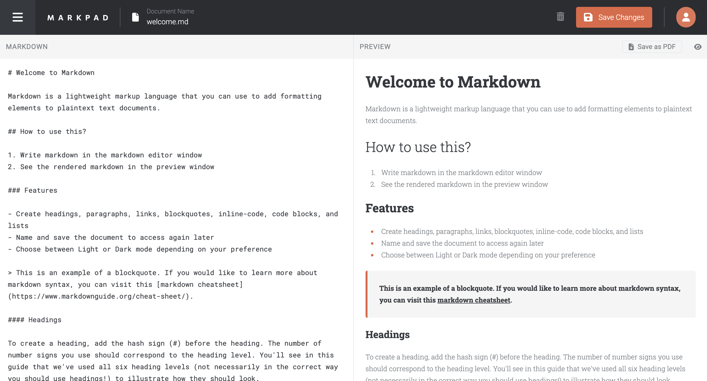

# markpad
> Markpad is an in-browser markdown editor application. Users can create and access their markdown documents as needed. As they edit, they can instantly view a formatted preview alongside the markdown content. App is optimized for saving the formatted documents as PDFs.

## Demo
[Live Demo](https://markpad.up.railway.app/)

## Built with
- React, Vite
- Flask, Python
- MySQL
- Flask-JWT-Extended
- React-Markdown
- HTML2PDF.js
- TailwindCSS
- HTML5/CSS3
- Hosted on Railway

## Features
#### Home Page:
- Call to action buttons for signing up and logging into an account
- Explore Demo button to allow users to test out the application as a demo user

#### Auth Page:
- User authentication supported with Flask JWT Extended with email and password encryption using Bcrypt password-hashing
- Custom form validation for login and sign up pages

#### Document Page:
- Create, read, update, and delete markdown documents
- Name and save documents to be accessed as needed
- Edit the markdown of a document and see the formatted preview of the content
- View a full-page preview of the formatted content
- Save the formatted documents as PDFs
- Hide/show the board sidebar
- Toggle the theme between light/dark modes

## Optimizations

## Lessons Learned

## Running this Project Locally
#### Server
In one terminal:
1. Create `.env` variables `SECRET_KEY` and `JWT_SECRET_KEY`
2. Run `pip install -r requirements.txt` to install all relevant packages and dependencies
3. Run `source bin/activate` to activate the virtual environment
4. Run `flask run` to start a dev server and view the project in your browser

#### Client
In a second terminal:
1. `cd` to the `client` directory
2. Run `npm install` to install all relevant dependencies
3. Run `npm run dev` to start a dev server and view the project in your browser
